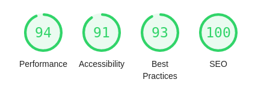
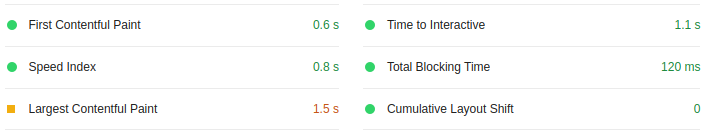

# Project Catwalk - by Atlantic Compass

> Modern front-end retail portal

## Table of contents

- [General info](#general-info)
- [Screenshots](#screenshots)
- [Technologies](#technologies)
- [Setup](#setup)
- [Performance](#performance)
- [Status](#status)
- [Created by](#created-by)

## General info

Project Catwalk comprises a complete redesign of a retail portal intended to revamp and modernize the site. The old client-facing retail web-portal has become significantly outdated and has been proven to be hurting sales numbers.
Built over the span of two weeks by a team of 3 engineers using Agile practices and progress tracking in a Trello board.

## Screenshots

## Technologies

- [React](https://reactjs.org/)
- [Redux](https://redux.js.org/)
- [Node.js](https://nodejs.dev/)
- [Express](https://expressjs.com/)
- [Axios](https://github.com/axios/axios)
- [jQuery](https://jquery.com/)
- [Sass](https://sass-lang.com/)

## Setup

From root directory run the following commands in the console

**npm install** to install all project dependencies  
**npm run build-css** to compile sass files  
**npm run build** to bundle project with webpack  
**npm run start** to launch server

In your browser navigate to http://localhost:4206

## Performance

**Lighthouse**  

**Performance Metric**  

## Status

Project is: _finished_

## Created by

[Joe DiMartino](https://github.com/Joed11)  
[David Lai](https://github.com/punkvidi)  
[Denis Sanches](https://github.com/efir-tractatus)
